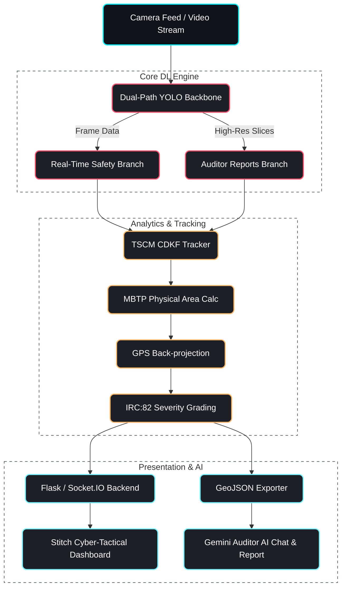
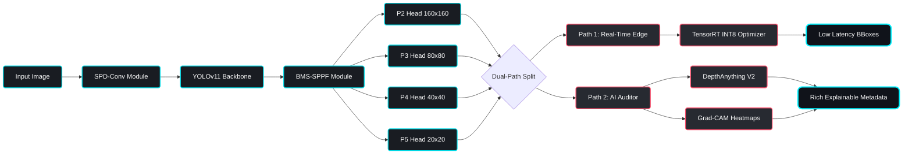
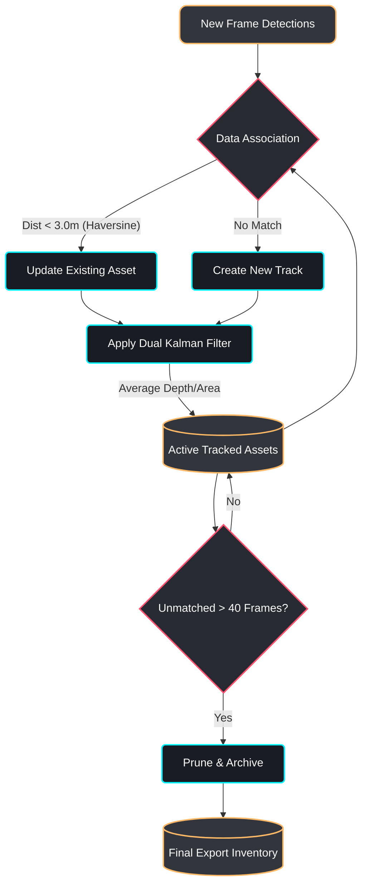
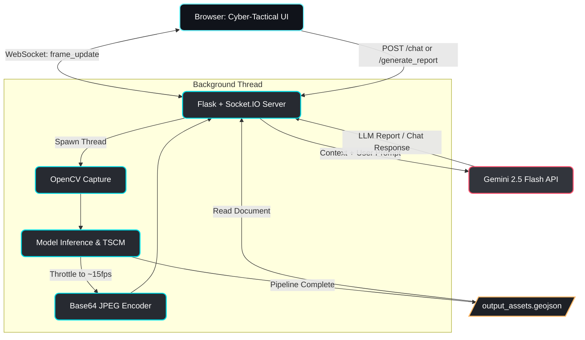

# DPR-RIA Architecture Diagrams

These Mermaid diagrams map out the high-level system flow and low-level component designs for the Dual-Path Road Infrastructure Analytics (DPR-RIA) system. They have been colored using your system's UI palette (Neon Blues, Crimson, and Amber) so they will look stunning on dark-mode presentation slides.

## 1. High-Level System Architecture

This diagram illustrates the end-to-end flow from the camera input through the DL engine, the analytics filters, and finally to the dashboard presentation and AI auditor.

---

## 2. LLD: Deep Learning Dual-Path YOLO Backbone

This diagram breaks down the custom PyTorch modifications. It highlights the `SPD-Conv` for retaining small defect data, the `BMS-SPPF` for spatial pooling, and the dual inference paths.

---

## 3. LLD: TSCM (Temporal-Spatial Consistency Module)

This diagram details the logic for the CDKF (Custom Dual Kalman Filter). It explains how the system avoids counting the same pothole multiple times by updating existing tracks based on geographic Haversine distance.

---

## 4. LLD: Live Web Dashboard & GenAI Flow

This diagram maps out the interaction between the frontend client, the Flask/Socket.IO backend running the background video processing thread, and the external Gemini 2.5 API for AI insights.

